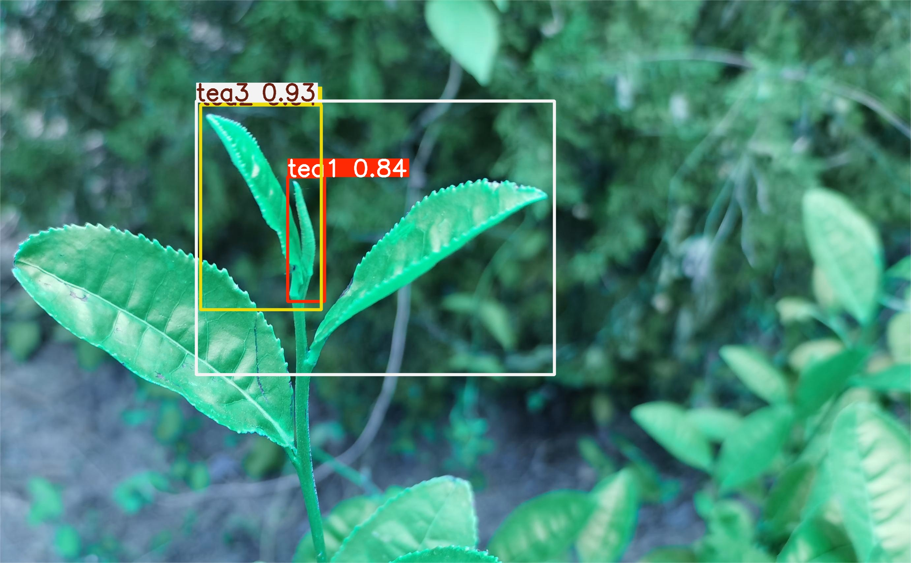
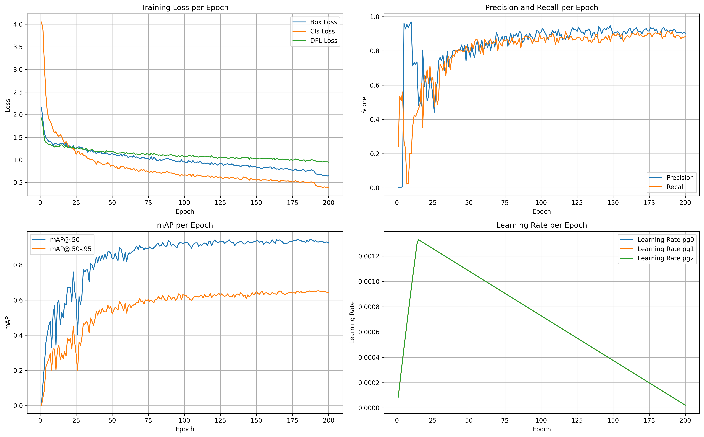

## YOLO11茶叶检测

## 代码部分
    data.yaml           配置文件
    split_data.py       分数据
    train.py            训练
    plot.py             画训练结果图
    inference.py        pt推理
    onnx_inference.py   onnx推理
    onnx_inference_2.py onnx推理（非官方）

